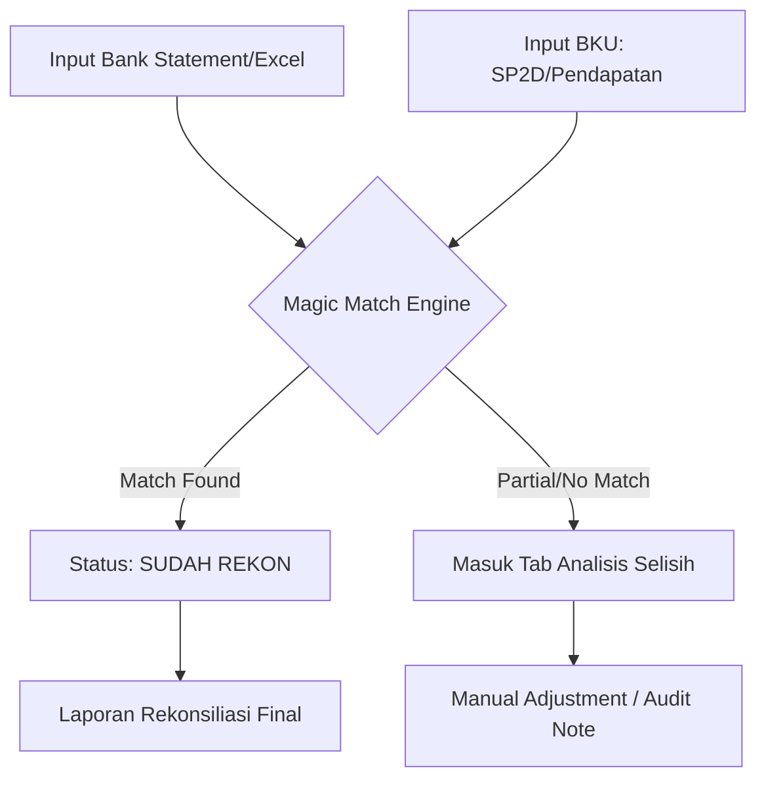

# Blueprint Aplikasi DSS BPKAD

## 1. Ringkasan Proyek (Overview)
**DSS BPKAD** (Decision Support System - Badan Pengelola Keuangan dan Aset Daerah) adalah sistem pendukung keputusan yang dirancang untuk mengelola, menganalisis, dan melakukan rekonsiliasi data keuangan daerah secara otomatis dan cerdas. Fokus utama aplikasi ini adalah sinkronisasi antara **Buku Kas Umum (BKU)** dan **Rekening Koran (Bank Statement)**.

---

## 2. Arsitektur Teknis (Tech Stack)

### **Frontend (Next.js Ecosystem)**
- **Framework**: Next.js 16 (React 19) dengan App Router.
- **Bahasa**: TypeScript.
- **Styling**: Tailwind CSS 4 & Vanilla CSS.
- **UI Components**: Radix UI (shadcn/ui), Framer Motion (Animations), Lucide React (Icons).
- **State Management & Fetching**: SWR (Data Fetching), Axios.
- **Visualisasi**: Chart.js & React-Chartjs-2.
- **Pengolahan Dokumen**: Tesseract.js (OCR), PDF.js, XLSX (Excel Processing), jsPDF.

### **Backend (Node.js Ecosystem)**
- **Runtime**: Node.js (Express.js).
- **ORM**: Prisma (PostgreSQL).
- **Database**: PostgreSQL.
- **Autentikasi**: JSON Web Token (JWT) & Bcrypt.
- **AI Integration**: Google Generative AI (Gemini SDK) untuk analisis data cerdas.
- **Utility**: Multer (Upload), Compression, CORS, ExcelJS.

---

## 3. Fitur Utama (Core Modules)

### **A. Dashboard Eksekutif**
- Visualisasi real-time saldo kas, pendapatan, dan pengeluaran.
- Tren realisasi anggaran per OPD (Organisasi Perangkat Daerah).
- Notifikasi anomali selisih rekon secara visual.

### **B. Rekonsiliasi Cerdas (Smart Reconciliation)**
- **Magic Match**: Algoritma pencocokan otomatis antara BKU (SP2D, Pendapatan, Pajak, Potongan) dengan Bank Statement berdasarkan nilai dan tanggal (window H+7).
- **Analisis Selisih**: Identifikasi transaksi yang belum cocok atau memiliki perbedaan nilai (Outstanding/Discrepancy).
- **Audit Anomali**: Pencatatan otomatis catatan audit untuk selisih di atas ambang batas tertentu (misal: > 100rb).

### **C. Manajemen Data Keuangan**
- **SP2D (Surat Perintah Pencairan Dana)**: Pengelolaan data bruto, neto, dan rincian potongan.
- **Pendapatan & Setoran Pajak**: Pencatatan arus kas masuk dan kewajiban pajak.
- **Manajemen Sumber Dana**: Pemisahan saldo berdasarkan bank dan jenis dana (DAU, DAK, PAD, dll).

### **D. Modul Talangan & Monitoring**
- **Monitoring Talangan**: Pelacakan penggunaan dana talangan antar rekening sumber dana.
- **Jurnal Talangan**: Pencatatan otomatis mutasi perpindahan dana untuk menutupi kebutuhan kas sementara.

### **E. Simulator & Integritas Data**
- **Scenario Simulator**: Fitur untuk mensimulasikan dampak transaksi terhadap saldo kas sebelum dieksekusi secara permanen.
- **Data Integrity Checker**: Script forensik untuk mendeteksi data korup atau yatim (orphan records).

---

## 4. Struktur Data Utama (Database Schema)

| Model | Deskripsi |
|-------|-----------|
| `users` | Manajemen pengguna dan role (Admin/Viewer). |
| `data_sp2d` | Data utama pengeluaran kas. |
| `data_sp2d_potongan` | Rincian potongan (pajak/iuran) dari SP2D. |
| `data_pendapatan` | Data arus kas masuk. |
| `bank_statement` | Rekaman mutasi bank (Rekening Koran). |
| `setoran_pajak` | Pencatatan pajak yang telah disetor. |
| `master_sumber_dana` | Definisi rekening dan jenis dana. |
| `jurnal_talangan` | Log perpindahan dana talangan. |

---

## 5. Alur Kerja Rekonsiliasi (Workflow)

---

## 6. Lokasi File Penting (Quick Access)
- **Backend Controllers**: `backend/controllers/` (Logika Bisnis).
- **Frontend Pages**: `frontend/src/app/dashboard/` (UI Dashboard).
- **Database Schema**: `backend/prisma/schema.prisma`.
- **Logic Rekon**: `backend/controllers/reconciliationController.js`.

---

## 7. Tips Debugging Cepat

| Gejala | Penyebab Paling Umum | Diagnosa / Solusi |
|--------|---------------------|-------------------|
| `KeyError` / `Undefined` | Data API tidak lengkap | Gunakan `.get(key)` (Python) atau Optional Chaining `?.` (JS) |
| `AttributeError: NoneType` | Hasil query Prisma kosong | Selalu cek `if (!record)` sebelum akses properti |
| `JSONDecodeError` | Backend crash / 500 error | Cek tab Network di DevTools atau `request_log.txt` di backend |
| `CORS error` | Port frontend/backend beda | Pastikan konfigurasi `cors` di `server.js` mengizinkan origin frontend |
| Query SQL Lambat | Record data terlalu besar | Gunakan `EXPLAIN ANALYZE` dan pastikan Index pada kolom `tanggal`/`is_matched` aktif |
| Selisih Tidak Akurat | Tipe data decimal mismatch | Pastikan casting `Decimal(20, 2)` konsisten di database dan logic |

---

## 8. Standar Pengembangan (Best Practices)

### **Backend (Python/Node)**
- **Error Handling**: Jangan gunakan *silent exception*. Gunakan logging terstruktur.
- **Security**: Gunakan *parameterized queries* (Prisma bawaan aman) dan hindari hardcode API Key (gunakan `.env`).
- **Validation**: Gunakan Pydantic atau schema validation untuk setiap input API.

### **Frontend (React)**
- **Type Safety**: Manfaatkan TypeScript strict mode untuk menghindari error runtime.
- **Performance**: Gunakan SWR untuk caching data dan optimasi re-render pada komponen tabel besar.
- **UI/UX**: Ikuti standar desain premium (vibrant colors, smooth transitions) yang telah ditetapkan.

---
*Dibuat oleh Antigravity AI Assistant (Optimized with Gemini 3 Flash Skill)*
