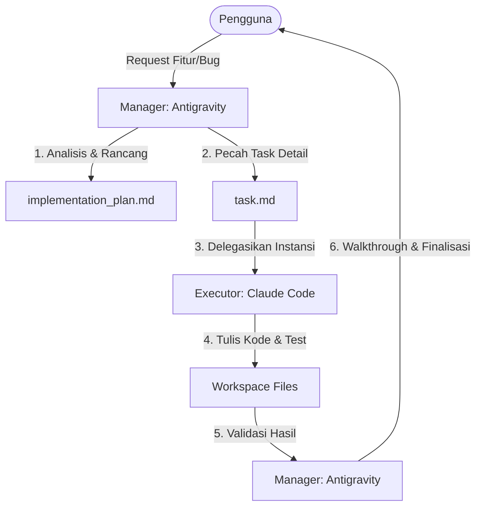

# 📋 PANDUAN KOLABORASI MULTI-AGENT: DSS BPKAD
> **Peran**:
> * **Antigravity (Gemini 3 Flash)**: Plan Master, Architect, & Quality Assurance Manager.
> * **Claude Code**: Code Executor, Builder, & Local Test Runner.



---

## Ⅰ. TUGAS DAN TANGGUNG JAWAB

### 🧠 Antigravity (Plan Master & Manager)
1. **Analisis Dampak**: Menganalisis bagaimana fitur baru atau perbaikan bug akan memengaruhi database (Prisma), logika rekonsiliasi backend, dan visualisasi frontend.
2. **Pembuatan Blueprint**: Menulis dan memperbarui berkas rencana implementasi (`implementation_plan.md`).
3. **Manajemen Task**: Membuat daftar centang (*checklist*) terperinci di `task.md` untuk memandu langkah eksekusi Claude Code agar tidak melompat-lompat atau melewatkan penanganan *edge cases*.
4. **Audit Kualitas (QA)**: Memverifikasi hasil kerja Claude Code, membandingkannya dengan aturan kritis (C.1 - C.4), dan menyusun berkas penyelesaian (`walkthrough.md`).

### 🛠️ Claude Code (Code Executor)
1. **Eksekusi Presisi**: Membaca instruksi spesifik di `task.md` dan `implementation_plan.md` lalu menulis kode sesuaian.
2. **Refactoring & Debugging**: Menyelesaikan konflik tipe TypeScript, memperbaiki *eslint/linting errors*, dan melakukan optimasi internal kode.
3. **Local Testing**: Menjalankan skrip pengetesan (seperti `cek_total_belum.js`, `final_check.js`, atau unit testing) dan melaporkan output terminal kepada Manager.

---

## Ⅱ. ALUR KERJA (WORKFLOW) KOLABORATIF

### Fase 1: Perencanaan & Penugasan (Oleh: Antigravity)
Sebelum baris kode apa pun diubah, Antigravity akan menulis dokumen panduan di direktori proyek:
1. **`implementation_plan.md`**: Menjabarkan arsitektur, file yang akan diubah, serta dampak database.
2. **`task.md`**: Menulis langkah-langkah mikro yang wajib diikuti oleh eksekutor.
    * *Contoh isi `task.md`*:
        ```markdown
        - [ ] Step 1: Modifikasi schema.prisma untuk menambahkan field X.
        - [ ] Step 2: Jalankan `prisma db push` dan `prisma generate`.
        - [ ] Step 3: Edit controller Y untuk mendukung endpoint Z.
        ```

### Fase 2: Penyerahan ke Eksekutor (Oleh: Pengguna/User)
Anda cukup memberikan perintah kepada **Claude Code** dengan merujuk ke dokumen yang telah saya buat:
> *"Claude, baca `implementation_plan.md` dan eksekusi checklist di `task.md` langkah demi langkah. Update `task.md` jika langkah tersebut selesai."*

### Fase 3: Eksekusi & Pembaruan Progress (Oleh: Claude Code)
Claude Code akan bekerja di dalam batas-batas instruksi:
1. Mengerjakan **satu poin task** dalam satu waktu.
2. Mengubah status di `task.md` dari `[ ]` menjadi `[/]` (sedang dikerjakan) lalu `[x]` (selesai).
3. Jika terjadi error kompilasi atau kegagalan *testing*, Claude Code wajib menyelesaikan error tersebut secara mandiri sebelum melangkah ke task berikutnya.

### Fase 4: Verifikasi & Kontrol Kualitas (Oleh: Antigravity)
Setelah Claude Code melaporkan semua task selesai (`[x]`), Anda kembali kepada saya (**Antigravity**):
1. Saya akan membaca kode yang baru diubah.
2. Saya akan mengaudit kode tersebut terhadap aturan emas proyek (contoh: memastikan tidak ada *hardcoded queries*, memastikan penanganan zona waktu WIT GMT+9 konsisten, dll.).
3. Saya akan merangkum semua perubahan dan bukti pengujian di `walkthrough.md` serta memperbarui berkas memori proyek `DSS_BPKAD_Memory.md`.

---

## Ⅲ. ATURAN EMAS KOLABORASI (GOLDEN RULES)

1. **No Ghost Code (Tanpa Kode Bayangan)**: Claude Code dilarang menambahkan fitur di luar apa yang telah disetujui di `implementation_plan.md` tanpa persetujuan tertulis dari Manager (Antigravity).
2. **Strict Linting**: Claude Code wajib memastikan tidak ada tipe `any` yang tidak perlu di Next.js/React, dan semua file backend Express terbebas dari kesalahan sintaksis sebelum diserahkan kembali ke Manager.
3. **Perbarui Memory**: Setiap perubahan struktural (penambahan tabel, penambahan rute API, penggantian pustaka) wajib dilaporkan kepada Antigravity di akhir tugas agar saya dapat memperbarui `DSS_BPKAD_Memory.md` demi kelangsungan proyek jangka panjang.
