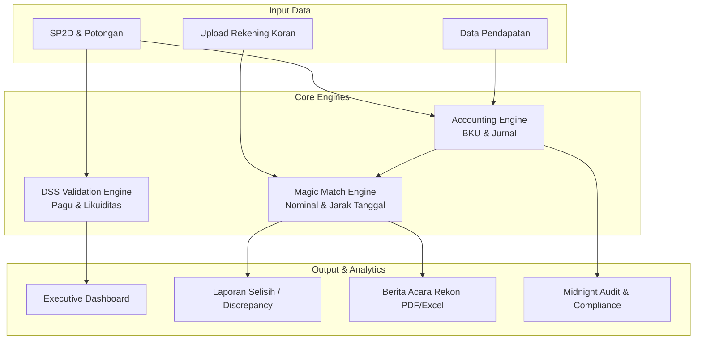
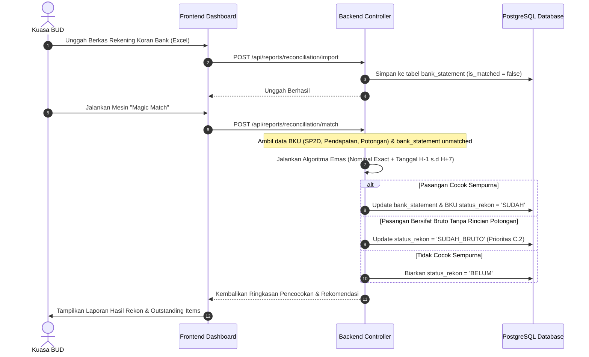

# PRODUCT REQUIREMENT DOCUMENT (PRD)
## Sistem Pendukung Keputusan (Decision Support System) BPKAD
### Kabupaten Kepulauan Aru

---

## 1. Ringkasan Eksekutif & Latar Belakang

### 1.1 Latar Belakang
Pengelolaan keuangan daerah pada Badan Pengelola Keuangan dan Aset Daerah (BPKAD) Kabupaten Kepulauan Aru menuntut ketelitian, kecepatan, dan transparansi yang sangat tinggi. Salah satu proses paling krusial dalam siklus akuntansi pemerintah daerah adalah **Rekonsiliasi Kas**—yaitu sinkronisasi berkala antara pencatatan Buku Kas Umum (BKU) oleh Kuasa Bendahara Umum Daerah (KBUD) dengan Rekening Koran (Bank Statement) dari Bank Persepsi (PT. Bank Maluku-Maluku Utara Cabang Dobo).

Sebelum adanya sistem ini, proses rekonsiliasi dilakukan secara manual, yang memakan waktu berhari-hari, rentan terhadap kesalahan manusia (*human error*), serta lambat dalam mendeteksi anomali. Krisis perbedaan pencatatan kas sebesar puluhan miliar Rupiah (seperti kasus investigasi saldo rekon pada Mei 2026) menegaskan perlunya sistem otomatisasi cerdas yang dapat mendeteksi selisih secara *real-time*, memvalidasi kecukupan likuiditas kas, serta memitigasi risiko *fraud* melalui validasi berlapis (*Triple-Lock Validation*).

### 1.2 Ringkasan Produk
**DSS BPKAD** adalah *Decision Support System* berbasis web terintegrasi yang dirancang khusus untuk memodernisasi kearsipan keuangan daerah dan mengotomatiskan proses rekonsiliasi kas secara presisi. Sistem ini menggabungkan pencatatan pengeluaran (SP2D beserta potongan/pajak), pendapatan, dana talangan, penyesuaian, dengan sistem pencocokan cerdas (**Magic Match**) yang menggunakan parameter nominal *exact cents* dan *window* penanggalan dinamis sesuai zona waktu Waktu Indonesia Timur (WIT / GMT+9).

---

## 2. Tujuan & Nilai Bisnis (Product Goals & Business Value)

| Tujuan Utama | Deskripsi & Dampak Bisnis |
|---|---|
| **Otomatisasi Rekonsiliasi** | Mengurangi waktu proses pencocokan BKU vs Rekening Koran dari mingguan menjadi hitungan detik dengan tingkat akurasi 100%. |
| **Mitigasi Risiko Saldo (Zero Leakage)** | Mencegah anomali selisih kas daerah melalui pendeteksian dini transaksi *outstanding* atau *discrepancy* di atas ambang batas (threshold Rp 100.000). |
| **Proteksi Likuiditas Kas** | Memberikan peringatan dini (*warning*) kepada pembuat kebijakan jika penarikan SP2D melebihi pagu anggaran atau saldo kas fisik efektif yang tersedia (termasuk pemanfaatan dana talangan). |
| **Integritas & Kepatuhan Audit** | Memenuhi standar audit BPK dengan mempertahankan *Audit Trail* yang tidak dapat dimanipulasi, pencatatan alasan manual adjustment, serta verifikasi *Midnight Audit* otomatis. |

---

## 3. Profil Pengguna (User Personas)

### 3.1 Kuasa Bendahara Umum Daerah (KBUD) / Operator Keuangan
*   **Peran**: Menginput data transaksi harian (SP2D, pendapatan, potongan pajak), mengunggah rekening koran bank, menjalankan proses *Magic Match*, dan melakukan penyesuaian manual jika terdapat transaksi selisih.
*   **Kebutuhan Utama**: Antarmuka yang cepat, pengisian tanggal pencairan yang mudah (bulk update), visualisasi saldo kas yang intuitif, serta notifikasi *error* yang jelas jika terjadi kegagalan validasi.

### 3.2 Kepala BPKAD / Eksekutif Daerah
*   **Peran**: Memantau kesehatan kas daerah, posisi dana talangan antar rekening, tren belanja per OPD, serta menandatangani Berita Acara Rekonsiliasi (BAR) Kas resmi.
*   **Kebutuhan Utama**: Dashboard eksekutif yang elegan, grafik interaktif, laporan anomali instan, dan ekspor laporan ke PDF berformat resmi pemerintah daerah.

### 3.3 Auditor / Administrator Sistem
*   **Peran**: Memantau log aktivitas sistem, mengelola pengguna/hak akses, mengaudit kepatuhan (*compliance score*), serta mendeteksi rekaman yatim (*orphan records*) melalui skrip forensik sistem.
*   **Kebutuhan Utama**: Log aktivitas mendalam, fungsi pembersihan data aman (*purge* terlindungi PIN khusus), dan visualisasi skor kepatuhan data.

---

## 4. Persyaratan Fungsional (Functional Requirements)

Sistem DSS BPKAD dibagi menjadi beberapa modul utama yang saling terintegrasi:

### 4.1 Modul Dashboard Eksekutif
*   **Analisis Kas Real-Time**: Menampilkan ringkasan Kas Fisik, Total Penggunaan Talangan, dan Kas Efektif (Kas Fisik - Talangan).
*   **Visualisasi Tren**: Grafik interaktif realisasi anggaran per Organisasi Perangkat Daerah (OPD) dan klasifikasi jenis belanja menggunakan `Chart.js`.
*   **Notifikasi Anomali**: Banner dinamis dan indikator warna visual untuk mendeteksi selisih rekon secara langsung di halaman depan.
*   **Pola Desain 4 Kolom Ringkasan**:
    1.  *Card Biru* (`bg-[#EFF8FF]`): Total Utama (Bruto/Pendapatan).
    2.  *Card Merah* (`bg-[#FEF3F2]`): Data Kritikal (Dana Talangan/Pengeluaran).
    3.  *Card Cyan* (`bg-[#F5F9FF]`): Aktivitas (Jumlah Transaksi).
    4.  *Card Amber* (`bg-amber-50`): Audit/Saldo/Selisih Kas.

### 4.2 Modul Rekonsiliasi Cerdas (Smart Reconciliation)
*   **Magic Match**: Mesin pencocokan otomatis satu-klik yang membandingkan transaksi Buku Kas Umum (BKU) dengan mutasi rekening koran berdasarkan parameter emas yang ketat (Nominal + Jarak Tanggal).
*   **Smart Suggestions**: Jika transaksi tidak cocok secara sempurna, sistem harus memberikan rekomendasi kandidat terbaik berdasarkan kedekatan nilai nominal dan jarak tanggal.
*   **Manual Unmatch**: Pengguna dapat membatalkan status rekonsiliasi per baris transaksi secara aman jika terjadi kesalahan pencocokan manusia.
*   **Cross-Highlighting**: Kemampuan UI untuk menyorot (*highlight*) baris pasangan transaksi di tabel rekening koran saat pengguna mengklik baris BKU terkait.

### 4.3 Modul Manajemen Data SP2D (Surat Perintah Pencairan Dana)
*   **Manajemen Alokasi Sumber Dana**: Setiap SP2D dapat dibagi ke beberapa rekening sumber dana (DAU, DAK, PAD, dll) dengan pencatatan nilai bruto dan neto.
*   **Kelengkapan Tanggal Pencairan**: Fitur khusus untuk mengisi `tanggal_pencairan` yang kosong secara masal (*bulk update*).
*   **Efek Cascading**: Pengisian `tanggal_pencairan` pada SP2D induk secara otomatis mengalir (*cascade*) ke rincian potongan terkait, memicu pencocokan ulang otomatis (*auto-rematch*) dengan rekening koran yang sesuai.
*   **Penyimpanan e-Arsip**: Modul unggah file scan PDF SP2D fisik untuk keperluan dokumentasi digital.

### 4.4 Modul Manajemen Pendapatan & Setoran Pajak
*   **Pencatatan Pendapatan**: Pemasukan kas daerah dengan penomoran bukti otomatis. Transaksi kas masuk dari Sisa Lebih Perhitungan Anggaran (SiLPA) dipaksa terposting pada tanggal 1 Januari untuk menjaga keutuhan saldo awal tahun anggaran.
*   **Setoran Pajak (NTPN)**: Pencatatan nomor transaksi penerimaan negara untuk memisahkan kewajiban pajak daerah agar tidak terjadi penghitungan ganda (*double counting*).

### 4.5 Modul Manajemen Dana Talangan (Cash Pooling & Monitoring)
*   **Monitoring Talangan**: Pelacakan saldo sementara yang dipinjam antar rekening sumber dana untuk menutupi kebutuhan kas yang mendesak.
*   **Jurnal Talangan Otomatis**: Pencatatan mutasi kredit/debet talangan secara otomatis ketika SP2D dicairkan dari rekening tertentu yang kekurangan saldo efektif.
*   **Auto-Settle**: Saat ada pendapatan masuk ke rekening sumber asli, sistem otomatis memotong untuk mengembalikan (*settle*) dana talangan yang dipinjam sebelumnya.

### 4.6 Modul Laporan & Buku Kas Umum (BKU)
*   **Laporan Komprehensif**: Menghasilkan Buku Kas Umum (BKU), Buku Pembantu Bank, Buku Pembantu Pajak, dan Buku Pembantu per OPD.
*   **Cetak Berkas Resmi**: Mesin cetak PDF (`PrintEngine.tsx`) yang menghasilkan Berita Acara Rekonsiliasi resmi lengkap dengan kop surat Pemerintah Kabupaten Kepulauan Aru dan kolom tanda tangan Kuasa BUD.

### 4.7 Modul Simulator Kas Cerdas (Scenario Simulator)
*   **Simulasi Transaksi**: Memungkinkan bendahara mensimulasikan dampak transaksi SP2D baru terhadap kecukupan saldo kas fisik efektif dan pagu anggaran sebelum data tersebut disimpan secara permanen di database.

---

## 5. Logika Bisnis & Aturan Rekonsiliasi (Critical Business Rules)

Berikut adalah aturan bisnis inti yang wajib dipatuhi oleh seluruh fungsi kode program di dalam sistem (Aturan C.1 s.d C.4):

### C.1 Independensi Potongan
Rincian potongan SP2D (seperti BPJS, IWP, PPN/PPH) bersifat **independen**. Status rekonsiliasi potongan **TIDAK** mengikuti status SP2D induknya. Setiap potongan harus dicocokkan sendiri ke mutasi bank atau bukti setoran pajak (NTPN). Hal ini krusial untuk mencegah *"Ghost Match"*—yaitu status potongan dianggap sudah rekon padahal uang pajaknya belum didebet dari bank.

### C.2 Prioritas Neto ke Bruto
Proses pencocokan otomatis (*Magic Match*) memprioritaskan pencarian berdasarkan **Nilai Neto** terlebih dahulu. Jika tidak ditemukan pasangan, mesin akan melakukan *fallback* mencari kecocokan pada **Nilai Bruto** (`SUDAH_BRUTO`). Hal ini untuk menangani kasus transfer pemindahbukuan dari RKUD ke Bank yang sering kali mencantumkan nilai bruto tanpa merinci potongan di mutasi bank. Nilai neto asli di database tidak boleh diubah; sistem hanya memperbarui `status_rekon` menjadi `SUDAH_BRUTO`.

### C.3 Parameter Emas Pencocokan (Gold Standard Matching)
Pencocokan mutasi bank dengan BKU disederhanakan dan diperketat menjadi **hanya 2 parameter**:
1.  **Nilai Nominal yang Presisi**: Perbandingan nilai nominal wajib presisi hingga satuan sen (dibulatkan ke *cents* via `Math.round(nilai * 100)`) untuk menghindari ketidakakuratan tipe data desimal.
2.  **Jarak Tanggal Dinamis**: Tanggal mutasi bank harus berada pada rentang **H-1 hingga H+7** dari `tanggal_pencairan` transaksi BKU.

> [!IMPORTANT]
> **Metode Text Matching (similarity score) telah dihapus sepenuhnya** dari mesin pencocokan karena perbedaan format penulisan deskripsi mutasi bank dengan uraian BKU di SIPD sangat tinggi, yang sering menimbulkan *false positive*.
> 
> **Aturan Keamanan Tambahan**: Jika deskripsi bank mengandung nomor dokumen tertentu yang bertentangan dengan nomor bukti di BKU, sistem wajib menolak pencocokan tersebut meskipun nilai nominalnya sama persis.

### C.4 Kewajiban Tanggal Pencairan (Pencairan-Centric)
Semua perhitungan arus pengeluaran kas di BKU dan Dashboard harus berbasis **`tanggal_pencairan`**, bukan tanggal pembuatan dokumen SP2D.
*   SP2D/potongan tanpa `tanggal_pencairan` tidak boleh dimasukkan ke dalam perhitungan saldo berjalan harian.
*   Sistem menyediakan antarmuka khusus di `/dashboard/sp2d/kelengkapan` agar pengguna dapat melengkapi tanggal pencairan yang kosong secara massal untuk menghindari kegagalan pencocokan.

### C.5 Pencegahan Double Counting (Setoran Pajak Guard)
Untuk mencegah pengeluaran pajak terhitung dua kali di dalam Buku Kas Umum (karena tercatat di potongan SP2D dan juga di setoran pajak eksternal), query pencatatan BKU menggunakan proteksi `NOT EXISTS` untuk memastikan tidak ada pencatatan ganda atas nomor bukti potongan yang sama.

### C.6 Perhitungan Saldo Bank Dinamis
Saldo akhir bank dihitung secara dinamis melalui formula:
$$\text{Saldo Akhir} = \sum(\text{Kredit}) - \sum(\text{Debet})$$
Penggunaan kolom static `saldo_akhir` di tabel rekening koran dilarang untuk menghindari data usang (*stale data*) akibat pengunggahan mutasi bank yang tidak berurutan.

---

## 6. Persyaratan Non-Fungsional (Non-Functional Requirements)

### 6.1 Keamanan & Kredensial (Security & Authorization)
*   **Autentikasi**: Menggunakan *JSON Web Token (JWT)* dengan masa berlaku 8 jam. Kredensial disimpan dengan enkripsi satu arah *Bcrypt*.
*   **Otorisasi Berbasis Peran**: Perbedaan akses antara `Admin` (akses penuh termasuk manipulasi master data) dan `Viewer/Operator` (terbatas pada penginputan transaksi dan peninjauan laporan).
*   **Proteksi Penghapusan Masal**: Penghapusan data secara masal (*Purge Data*) membutuhkan otentikasi PIN khusus (`special_pin`, default: `1234`) dan hanya dapat diakses oleh peran administrator.
*   **Catatan Audit (Audit Trail)**: Setiap tindakan sensitif (penyesuaian saldo, pencocokan manual, perubahan status rekon) wajib mencatatkan log aktivitas ke tabel `log_aktivitas` lengkap dengan informasi pengguna, waktu (WIT), dan aksi yang dilakukan.

### 6.2 Performa & Skalabilitas (Performance)
*   **Penanganan Keuangan Presisi**: Tipe data finansial di tingkat database wajib menggunakan `Decimal(20,2)` untuk menghindari pembulatan mengambang (*floating point error*).
*   **Optimasi Kueri**: Menggunakan kueri SQL gabungan (*UNION*) yang dioptimalkan untuk memuat puluhan ribu data BKU secara cepat. Indexing wajib diterapkan pada kolom kunci seperti `tanggal`, `tanggal_pencairan`, dan `status_rekon`.
*   **Caching & Sinkronisasi**: Frontend memanfaatkan pustaka `SWR` untuk melakukan *caching* kueri, menghindari *re-rendering* berlebih pada tabel data berukuran besar, dan menyelaraskan pembaruan data secara real-time.

### 6.3 Desain Antarmuka (UI/UX & Aesthetics)
*   **Premium & State of the Art**: Antarmuka modern yang responsif menggunakan Next.js dengan styling Tailwind CSS 4 dan Radix UI (shadcn/ui).
*   **Aksen Visual Terarah**: Penerapan kontras warna tinggi untuk status rekonsiliasi (Hijau untuk "SUDAH", Merah untuk "BELUM", Kuning untuk "SEBAGIAN").
*   **Zona Waktu Konsisten**: Seluruh format penanggalan dipaksa mengikuti format WIT (GMT+9) menggunakan utilitas `dateUtils.js` (`fmtDateWIT`) untuk mencegah pergeseran hari akibat perbedaan zona waktu server.

---

## 7. Arsitektur Data & Skema Database

Berikut adalah representasi tabel-tabel utama penyusun sistem DSS BPKAD:

| Nama Tabel | Deskripsi & Kolom Kunci | Keterangan Relasi / Aturan |
|---|---|---|
| `users` | Akun pengguna: `id` (UUID), `username`, `password_hash`, `role`, `special_pin`. | Autentikasi dan otorisasi. |
| `master_sumber_dana` | Rekening kas daerah: `id` (VARCHAR), `nama`, `nomor_rekening`, `kategori`. | Menjadi referensi dasar likuiditas kas. |
| `data_sp2d` | Dokumen pengeluaran: `nomor` (Unique), `tanggal`, `tanggal_pencairan` (Nullable), `nilai_bruto`, `nilai_neto`, `status_rekon`. | Memiliki relasi satu-ke-banyak dengan rincian dana dan potongan. |
| `detail_sp2d` | Alokasi dana SP2D: `id_sp2d` (FK), `id_sumber_dana` (FK), `nilai_bruto`, `nilai_neto`. | Memecah satu SP2D ke beberapa sumber kas. |
| `data_sp2d_potongan` | Rincian potongan SP2D: `id` (UUID), `id_sp2d` (FK), `tanggal_pencairan` (Nullable), `jenis_potongan`, `nilai`, `status_rekon`, `keterangan_rekon`. | **Independen**. Tidak memiliki kolom `nomor_bukti`. Status rekon dicocokkan sendiri. |
| `bank_statement` | Rekening Koran Bank: `tanggal`, `nomor_bukti`, `debet`, `kredit`, `is_matched`, `ref_bku_id`, `match_type`. | Mutasi bank. Saldo akhir dihitung dinamis dari debet/kredit. |
| `data_pendapatan` | Kas Masuk: `tanggal`, `nomor_bukti` (Unique), `uraian`, `nilai`, `status_rekon`. | Pencatatan penerimaan dana. |
| `setoran_pajak` | NTPN Pajak: `nomor_bukti`, `ntpn`, `tanggal`, `nilai`, `opd`. | Digunakan sebagai guard agar pajak potongan tidak *double count*. |
| `jurnal_talangan` | Log dana talangan: `id` (UUID), `id_sumber_asli`, `id_sumber_talangan`, `nilai`, `status` (BELUM/SELESAI). | Melacak posisi hutang-piutang kas antar sumber dana. |
| `data_penyesuaian` | Koreksi kas: `tanggal`, `nomor_bukti`, `uraian`, `nilai`, `jenis` (MASUK/KELUAR), `sisi_pengaruh`. | Koreksi pembukuan manual. |

---

## 8. Alur Kerja Rekonsiliasi (Magic Match Workflow)

Pencocokan cerdas harian dipicu oleh pengguna dengan mengikuti diagram alir berikut:

---

## 9. Kriteria Penerimaan & Verifikasi (Acceptance Criteria)

### 9.1 Skenario Pencocokan Otomatis (Magic Match)
*   **Kriteria**: Ketika pengguna menjalankan Magic Match, transaksi BKU senilai Rp 10.500.250,50 dengan `tanggal_pencairan` 12 Mei 2026 harus otomatis ter-match dengan mutasi debet rekening koran senilai Rp 10.500.250,50 tertanggal 15 Mei 2026 (selisih 3 hari, masuk window H-1 s.d H+7).
*   **Verifikasi**: Jalankan kueri data rekonsiliasi. Transaksi harus berstatus `SUDAH` dengan `match_type` terisi dan `ref_bku_id` merujuk ke ID transaksi BKU yang benar.

### 9.2 Skenario Independensi Potongan (C.1)
*   **Kriteria**: Apabila sebuah dokumen SP2D senilai Rp 100.000.000 (Neto: Rp 90.000.000, Potongan BPJS: Rp 10.000.000) rekon dengan mutasi bank sebesar Rp 90.000.000, status SP2D berubah menjadi `SUDAH`, namun status data potongan BPJS harus **tetap `BELUM`** sampai ditemukan setoran pajaknya secara terpisah.
*   **Verifikasi**: Memastikan tidak ada *cascading update* status rekon dari tabel `data_sp2d` ke tabel `data_sp2d_potongan` secara otomatis.

### 9.3 Skenario Pencegahan Over-draft / Likuiditas Pagu (DSS Engine)
*   **Kriteria**: Saat operator menginput SP2D baru yang nilainya melebihi sisa Pagu Anggaran OPD tersebut atau melebihi Kas Efektif Sumber Dana yang dipilih, sistem harus menolak penyimpanan data dan memunculkan modal peringatan opsi pemanfaatan Dana Talangan.
*   **Verifikasi**: Uji input data SP2D dengan nilai melampaui sisa pagu di unit kerja uji coba; pastikan API mengembalikan status kode `400 Bad Request` dengan pesan peringatan likuiditas/pagu.

---

*Dokumen Persyaratan Produk (PRD) ini disusun secara komprehensif oleh Antigravity AI Assistant dengan referensi ke standar implementasi sistem keuangan daerah BPKAD Kabupaten Kepulauan Aru (Terakhir diperbarui: Mei 2026).*
