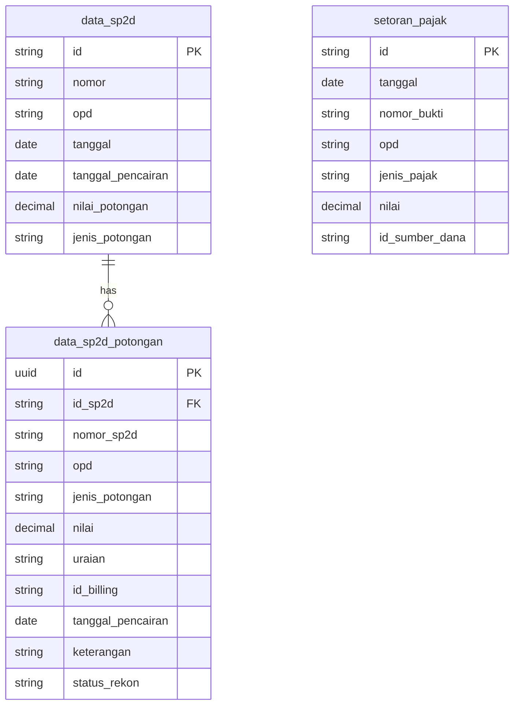

# 📋 Plan: Realisasi Rincian Potongan Per OPD

## 1. Latar Belakang & Tujuan

Sistem DSS BPKAD saat ini sudah memiliki data **potongan SP2D** (`data_sp2d_potongan`) dan **setoran pajak** (`setoran_pajak`) yang tersebar di beberapa modul (BKU, BP Potongan, Rekonsiliasi). Namun belum ada **satu halaman terpusat** yang menyajikan **Realisasi Rincian Potongan Per OPD** — yaitu laporan lengkap semua potongan yang dipungut dan disetor oleh setiap OPD dalam periode tertentu, lengkap dengan rincian jenis potongan, nomor SP2D, tanggal, dan statusnya.

**Tujuan menu baru ini:**
- Menyediakan laporan rinci potongan per OPD dengan filter fleksibel
- Memberikan rekapitulasi ringkasan per OPD dan per jenis potongan
- Mendukung cetak dan ekspor Excel
- Memudahkan audit kewajiban potongan yang belum disetor

---

## 2. Rekomendasi Penempatan Menu

> [!IMPORTANT]
> **Rekomendasi: Di bawah grup "Buku Pembantu" → Subitem baru**

### Opsi yang Dipertimbangkan:

| Opsi | Lokasi | Alasan Pro | Alasan Kontra |
|------|--------|------------|---------------|
| **A** ✅ | **Buku Pembantu → "Realisasi Potongan OPD"** | Secara fungsional ini adalah *subsidiary ledger* (buku pembantu) untuk potongan per OPD. Konsisten dengan pola BP Bank, BP Potongan, dan BP OPD yang sudah ada. | — |
| B | Laporan → Subitem baru | Bisa masuk sebagai laporan | Grup "Laporan" sudah padat (BKU, Jurnal, Talangan, Penyesuaian) |
| C | Manajemen Potongan → Subitem baru | Terkait langsung dengan potongan | Grup ini fokus ke *input* (rekam & monitoring), bukan *reporting* |

### Perubahan Sidebar:

```diff
 {
   title: 'Buku Pembantu',
   icon: Layers,
   items: [
     { name: 'BP Bank (Rekening)', href: '/dashboard/ledgers/bank', icon: Banknote },
     { name: 'BP Potongan (Pajak/IWP)', href: '/dashboard/ledgers/pajak', icon: Scale },
     { name: 'BP Unit Kerja (OPD)', href: '/dashboard/ledgers/opd', icon: Building2 },
+    { name: 'Realisasi Potongan OPD', href: '/dashboard/ledgers/potongan-opd', icon: FileSpreadsheet },
   ]
 }
```

---

## 3. Sumber Data

Data diambil dari **3 tabel utama**:



### Logika Penggabungan Data:

1. **Potongan Rincian** (dari `data_sp2d_potongan`): Record individual potongan dengan `keterangan != 'AUTO_HEADER'` — ini adalah potongan manual/rincian yang dicatat per transaksi.
2. **Setoran Pajak** (dari `setoran_pajak`): Penyetoran langsung ke kas negara yang tidak tercatat di `data_sp2d_potongan`.
3. **Header Potongan** (dari `data_sp2d.nilai_potongan`): Sebagai validasi silang — total potongan yang tertera di SP2D.

---

## 4. Fitur Halaman

### 4.1 Filter Bar (Atas)

| Filter | Tipe | Default | Keterangan |
|--------|------|---------|------------|
| **Tahun** | `<select>` | Tahun berjalan | 2024, 2025, 2026, ... |
| **Bulan** | `<select>` | Semua (0) | Januari–Desember, atau "Semua Bulan" |
| **Rentang Tanggal** | Date Range (dari–sampai) | Awal–Akhir bulan terpilih | Override filter bulan jika diisi manual |
| **OPD** | `<select>` + search | Semua | Dropdown daftar OPD dari `master_opd` |
| **Jenis Potongan** | `<select>` | Semua | PPh 21, PPh 22, PPh 23, PPN, IWP, Taperum, BPJS, Lainnya |
| **Sumber** | `<select>` | Semua | `POTONGAN_BANK` (rincian) vs `INPUT_MANUAL` (setoran) |

### 4.2 Kartu Ringkasan (Summary Cards)

```
┌────────────────────┐  ┌────────────────────┐  ┌────────────────────┐  ┌────────────────────┐
│  📊 Total Potongan  │  │  💰 Total Disetor   │  │  ⚠️ Selisih/Utang   │  │  📄 Jumlah Dokumen  │
│  Rp 2.500.000.000  │  │  Rp 2.350.000.000  │  │  Rp 150.000.000   │  │  1.245 transaksi   │
│  dari 45 OPD       │  │  94% realisasi     │  │  6% outstanding   │  │  bulan ini: 120    │
└────────────────────┘  └────────────────────┘  └────────────────────┘  └────────────────────┘
```

### 4.3 Tabel Utama: Rekapitulasi Per OPD

**View Default — Ringkasan Per OPD:**

| No | OPD | Total Dipungut | Total Disetor | Selisih | Jml Dokumen | Status |
|----|-----|---------------|---------------|---------|-------------|--------|
| 1 | DINAS PENDIDIKAN | Rp 500.000.000 | Rp 480.000.000 | Rp 20.000.000 | 85 | ⚠️ Belum Lunas |
| 2 | DINAS KESEHATAN | Rp 320.000.000 | Rp 320.000.000 | Rp 0 | 62 | ✅ Lunas |
| ... | ... | ... | ... | ... | ... | ... |

> [!TIP]
> Klik baris OPD untuk **expand/detail** rincian potongan individu OPD tersebut.

### 4.4 Tabel Detail (Expandable Row / Sub-view)

Ketika user klik satu baris OPD, tampilkan tabel detail:

| Tanggal | No. SP2D | Jenis Potongan | Uraian | ID Billing | Nilai | Status |
|---------|----------|----------------|--------|------------|-------|--------|
| 15/03/2026 | SP2D-001/KEU/2026 | PPh 21 | Pot. PPh Pegawai | 123456 | Rp 5.000.000 | ✅ Disetor |
| 20/03/2026 | SP2D-005/KEU/2026 | PPN | Pot. PPN Pengadaan | 789012 | Rp 3.200.000 | ⏳ Belum |

### 4.5 Aksi Toolbar

| Aksi | Icon | Keterangan |
|------|------|------------|
| 🖨️ **Cetak PDF** | Printer icon | Cetak laporan rekapitulasi format resmi |
| 📥 **Download Excel** | Download icon | Ekspor ke .xlsx dengan semua detail + ringkasan |
| 🔄 **Refresh** | Refresh icon | Reload data terbaru |

---

## 5. Alur Implementasi (Backend → Frontend)

### Phase 1: Backend API

**File:** `backend/controllers/reportController.js`

**Endpoint baru:** `GET /api/reports/potongan-opd-realisasi`

**Query Parameters:**
```
?tahun=2026&bulan=3&startDate=2026-03-01&endDate=2026-03-31&opd=DINAS+PENDIDIKAN&jenisPotongan=PPh+21
```

**Response Structure:**
```json
{
  "summary": {
    "totalDipungut": 2500000000,
    "totalDisetor": 2350000000,
    "selisih": 150000000,
    "totalDokumen": 1245,
    "jumlahOpd": 45
  },
  "data": [
    {
      "opd": "DINAS PENDIDIKAN",
      "totalDipungut": 500000000,
      "totalDisetor": 480000000,
      "selisih": 20000000,
      "jumlahDokumen": 85,
      "status": "BELUM_LUNAS",
      "rincian": [
        {
          "id": "uuid-1",
          "tanggal": "2026-03-15",
          "nomorSp2d": "SP2D-001/KEU/2026",
          "jenisPotongan": "PPh 21",
          "uraian": "Potongan PPh Pegawai",
          "idBilling": "123456",
          "nilai": 5000000,
          "tipe": "POTONGAN_BANK",
          "statusRekon": "SUDAH"
        }
      ]
    }
  ],
  "breakdownJenis": [
    { "jenis": "PPh 21", "total": 800000000, "count": 350 },
    { "jenis": "PPN", "total": 600000000, "count": 280 }
  ]
}
```

**SQL Logic (Pseudocode):**
```sql
-- Gabungkan data_sp2d_potongan (rincian manual) + setoran_pajak
-- GROUP BY OPD, hitung total per OPD
-- Sub-query untuk rincian individu per OPD
-- Cross-reference dengan data_sp2d.nilai_potongan untuk validasi
```

**Registrasi Route:**
```js
// di reportRoutes.js
router.get('/potongan-opd-realisasi', authMiddleware, reportController.getPotonganOpdRealisasi);
```

---

### Phase 2: Frontend Page

**File:** `frontend/src/app/dashboard/ledgers/potongan-opd/page.tsx`

**Komponen Utama:**
1. **FilterBar** — Tahun, Bulan, Rentang Tanggal, OPD, Jenis Potongan
2. **SummaryCards** — 4 kartu ringkasan
3. **OPDTable** — Tabel rekapitulasi per OPD (expandable rows)
4. **DetailSubTable** — Rincian transaksi per OPD
5. **ActionToolbar** — Cetak, Download Excel, Refresh

**Tech Stack:**
- **Data fetching:** `useSWR` (konsisten dengan modul lain)
- **Tabel:** Custom table component (konsisten dengan BKU, BP Pajak)
- **Excel:** `xlsx` / `exceljs` package (client-side generation)
- **Cetak:** `PrintEngine` component yang sudah ada
- **Styling:** HSL design system (`fin-*` tokens)

---

### Phase 3: Excel Export

**Struktur File Excel (.xlsx):**

| Sheet | Konten |
|-------|--------|
| **Rekapitulasi** | Ringkasan per OPD (kolom: OPD, Dipungut, Disetor, Selisih, Status) |
| **Rincian** | Semua transaksi (kolom: Tanggal, No.SP2D, OPD, Jenis, Uraian, Billing, Nilai, Status) |
| **Per Jenis** | Breakdown per jenis potongan (PPh 21, PPN, IWP, dll) |

**Nama file:** `Realisasi_Potongan_OPD_{Bulan}_{Tahun}.xlsx`

---

### Phase 4: Cetak PDF

Menggunakan `PrintEngine` yang sudah ada, dengan template:

```
┌──────────────────────────────────────────────────────────────────┐
│                    PEMERINTAH KABUPATEN KEPULAUAN ARU            │
│         BADAN PENGELOLAAN KEUANGAN DAN ASET DAERAH              │
│                                                                  │
│          REALISASI RINCIAN POTONGAN PER OPD                      │
│          Periode: Maret 2026 (01/03/2026 s.d 31/03/2026)        │
│                                                                  │
│  No │ OPD            │ Dipungut      │ Disetor       │ Selisih  │
│  ───┼────────────────┼───────────────┼───────────────┼──────────│
│  1  │ Dinas Pendidikan│ 500.000.000  │ 480.000.000   │20.000.000│
│  2  │ Dinas Kesehatan │ 320.000.000  │ 320.000.000   │    0     │
│  ...│ ...            │ ...           │ ...           │ ...      │
│     │ TOTAL          │2.500.000.000  │2.350.000.000  │150.000.00│
│                                                                  │
│  Dobo, 31 Maret 2026                                            │
│  Kepala BPKAD Kab. Kepulauan Aru                                │
│                                                                  │
│  _______________________                                         │
│  NIP. xxx                                                        │
└──────────────────────────────────────────────────────────────────┘
```

---

## 6. Perubahan Sidebar

**File:** `frontend/src/components/Sidebar.tsx`

```diff
 {
   title: 'Buku Pembantu',
   icon: Layers,
   dotColor: 'bg-ds-primary',
   items: [
     { name: 'BP Bank (Rekening)', href: '/dashboard/ledgers/bank', icon: Banknote },
     { name: 'BP Potongan (Pajak/IWP)', href: '/dashboard/ledgers/pajak', icon: Scale },
     { name: 'BP Unit Kerja (OPD)', href: '/dashboard/ledgers/opd', icon: Building2 },
+    { name: 'Realisasi Potongan OPD', href: '/dashboard/ledgers/potongan-opd', icon: FileSpreadsheet },
   ]
 }
```

---

## 7. Estimasi Waktu & Checklist

| # | Task | Estimasi | Prioritas |
|---|------|----------|-----------|
| 1 | Backend: API endpoint `getPotonganOpdRealisasi` | 20 menit | 🔴 Kritis |
| 2 | Backend: Register route di `reportRoutes.js` | 2 menit | 🔴 Kritis |
| 3 | Frontend: Buat `page.tsx` dengan filter, cards, tabel | 45 menit | 🔴 Kritis |
| 4 | Frontend: Expandable row detail | 15 menit | 🟡 Penting |
| 5 | Frontend: Excel export (`xlsx`) | 15 menit | 🟡 Penting |
| 6 | Frontend: Cetak via PrintEngine | 10 menit | 🟡 Penting |
| 7 | Sidebar: Tambah menu item + icon import | 3 menit | 🔴 Kritis |
| 8 | TypeScript check + polish | 10 menit | 🟢 Final |
| | **Total estimasi** | **~2 jam** | |

---

## 8. Dependensi & Risiko

> [!WARNING]
> **Risiko utama:** Data `opd` pada `data_sp2d_potongan` dan `setoran_pajak` bisa tidak konsisten (case-sensitivity, whitespace). Query harus menggunakan `UPPER(TRIM(opd))` untuk normalisasi.

| Dependensi | Status |
|------------|--------|
| Tabel `data_sp2d_potongan` | ✅ Sudah ada |
| Tabel `setoran_pajak` | ✅ Sudah ada |
| Tabel `master_opd` | ✅ Sudah ada (untuk dropdown) |
| `PrintEngine` component | ✅ Sudah ada |
| Package `xlsx`/`exceljs` | ⚠️ Perlu install jika belum ada |
| Endpoint `getOpdTaxSummary` | ✅ Sudah ada (bisa dipakai sebagai referensi) |

---

## 9. Wireframe Visual

```
┌─ Sidebar ──────┐  ┌─ Main Content ──────────────────────────────────────────────┐
│                 │  │                                                              │
│ ...             │  │  📊 Realisasi Rincian Potongan Per OPD                       │
│ Buku Pembantu ▼ │  │  ─────────────────────────────────────                       │
│   BP Bank       │  │  [Tahun ▼] [Bulan ▼] [Dari ___] [Sampai ___]               │
│   BP Potongan   │  │  [OPD ▼] [Jenis Potongan ▼] [🔄 Refresh]                   │
│   BP OPD        │  │                                                              │
│ ▸ Realisasi ◀── │  │  ┌──────────┐ ┌──────────┐ ┌──────────┐ ┌──────────┐       │
│   Potongan OPD  │  │  │Total     │ │Total     │ │Selisih   │ │Jumlah    │       │
│                 │  │  │Dipungut  │ │Disetor   │ │Outstanding│ │Dokumen   │       │
│                 │  │  │Rp 2.5 M  │ │Rp 2.35 M │ │Rp 150 Jt │ │1.245     │       │
│                 │  │  └──────────┘ └──────────┘ └──────────┘ └──────────┘       │
│                 │  │                                                              │
│                 │  │  [🖨️ Cetak] [📥 Excel] [🔍 Cari: _______________]           │
│                 │  │                                                              │
│                 │  │  ┌───┬──────────────────┬───────────┬───────────┬─────┬────┐ │
│                 │  │  │No │ OPD              │ Dipungut  │ Disetor   │Selisih│St│ │
│                 │  │  ├───┼──────────────────┼───────────┼───────────┼─────┼────┤ │
│                 │  │  │ 1 │ ▸ DINAS PENDIDIKAN│ 500 Jt   │ 480 Jt    │20 Jt│ ⚠️ │ │
│                 │  │  │   │ ┌─ Rincian ─────────────────────────────────┐  │    │ │
│                 │  │  │   │ │ 15/03 │ SP2D-001 │ PPh 21 │ 5 Jt │ ✅    │  │    │ │
│                 │  │  │   │ │ 20/03 │ SP2D-005 │ PPN    │ 3.2Jt│ ⏳    │  │    │ │
│                 │  │  │   │ └───────────────────────────────────────────┘  │    │ │
│                 │  │  │ 2 │ DINAS KESEHATAN  │ 320 Jt   │ 320 Jt    │  0  │ ✅ │ │
│                 │  │  └───┴──────────────────┴───────────┴───────────┴─────┴────┘ │
│                 │  │                                                              │
│                 │  │  Menampilkan 1-20 dari 45 OPD     [◀ 1 2 3 ▶]               │
│                 │  │                                                              │
│ © Vico          │  └──────────────────────────────────────────────────────────────┘
│   Masbaitubun   │
└─────────────────┘
```

---

## 10. Pertanyaan untuk User

> [!NOTE]
> Sebelum mulai implementasi, mohon konfirmasi:

1. **Apakah penempatan di "Buku Pembantu" sudah sesuai**, atau Anda lebih ingin di grup lain?
2. **Apakah fitur expand/collapse per OPD** sudah cukup, atau Anda ingin halaman detail terpisah untuk setiap OPD?
3. **Apakah ada jenis potongan khusus** yang perlu ditonjolkan (contoh: IWP, Taperum, BPJS terpisah dari PPh)?
4. **Apakah format cetak PDF** perlu tanda tangan pejabat (seperti BAR), atau cukup laporan informatif?

Silakan konfirmasi, dan saya akan langsung mulai implementasi sesuai plan ini! 🚀
